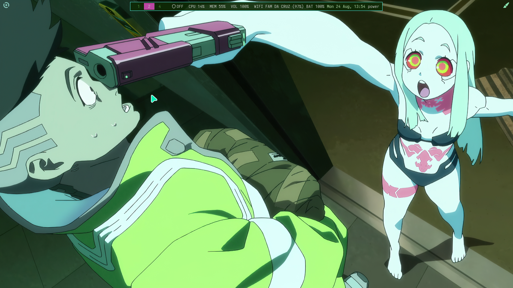
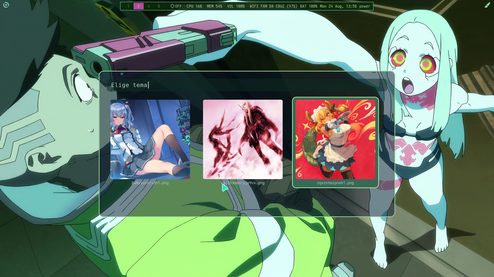
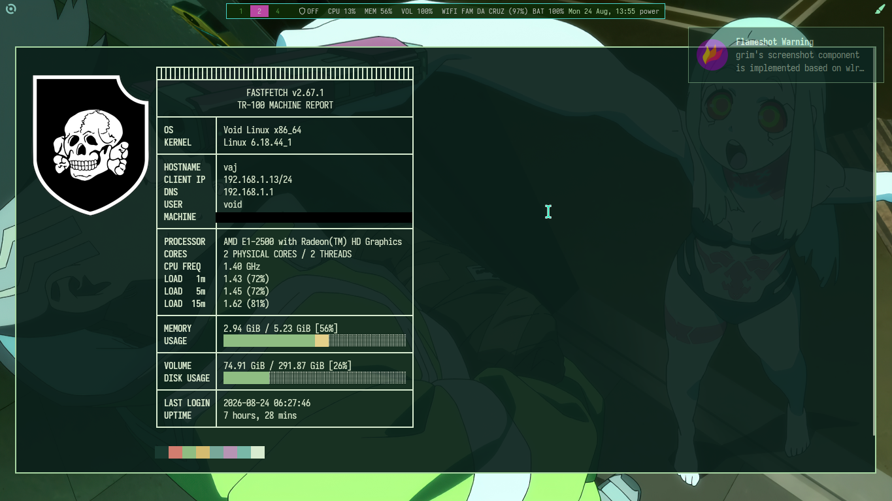
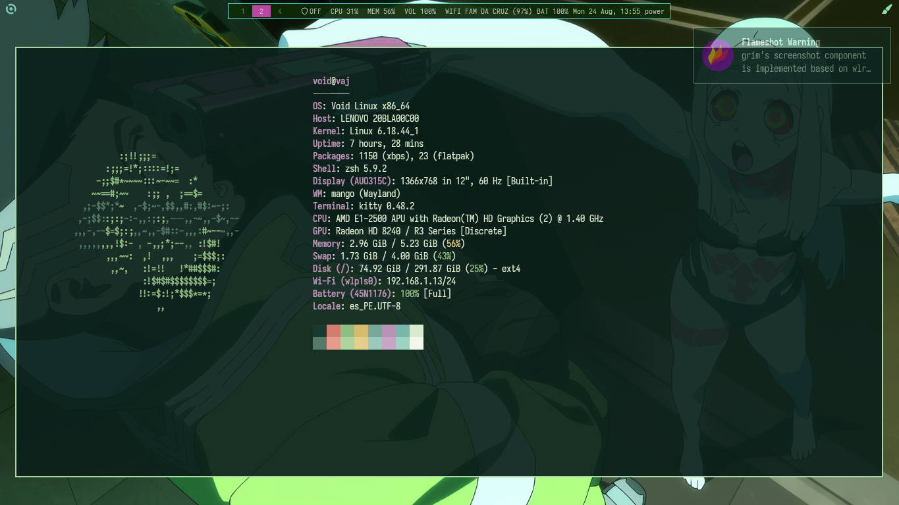
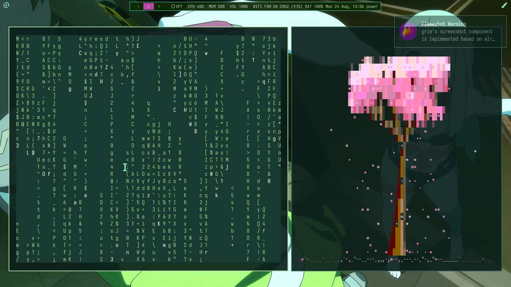

<div align="center">

# 🌿 Void-thinkpad

### Dotfiles minimalistas para Void Linux en un ThinkPad X140e

Tema pastel/verde generado dinámicamente con **pywal** a partir del wallpaper activo —
terminal, waybar, cursor y rofi cambian de color juntos.

</div>

---

## 🖥️ Specs

| | |
|---|---|
| **OS** | Void Linux x86_64 |
| **WM** | mango (Wayland) |
| **Terminal** | Alacritty |
| **Shell** | Zsh + Starship (pastel-powerline) |
| **Bar** | Waybar |
| **Launcher** | Rofi |
| **Laptop** | Lenovo ThinkPad X140e — AMD E1-2500 |

---

## 📸 Screenshots

<div align="center">

**Waybar + tema pastel**


**Selector visual de wallpapers (rofi)**


**Fastfetch**

 

**cmatrix + sakura-bonsai**


</div>

---

## ✨ Features

- 🎨 **Theming automático con pywal** — cada wallpaper genera su propia paleta de colores, aplicada en vivo a terminal, waybar y rofi.
- 🖼️ **Selector visual de wallpapers** — menú tipo carrusel en rofi con miniaturas, cambia el fondo y el tema completo con un atajo de teclado.
- 💻 **Prompt personalizado** con Starship (preset pastel-powerline).
- 📊 **Fastfetch** con logo 3D rotativo custom.
- 🪶 Configurado para hardware modesto (AMD E1-2500, 2 núcleos) — todo ligero, sin efectos pesados de GPU.

---

## 📦 Estructura

    dotfiles/
    ├── config/
    │   ├── alacritty/
    │   ├── fastfetch/
    │   ├── mako/
    │   ├── mango/
    │   ├── rofi/
    │   ├── waybar/
    │   └── starship.toml
    ├── mango/
    ├── waybar/
    ├── wlogout/
    ├── .bashrc
    └── .zshrc

---

<div align="center">

Hecho con 💚 en Void Linux

</div>

---

## 🚀 Instalación

> ⚠️ Estos dotfiles asumen **Void Linux** con **mango** (Wayland). Revisa cada archivo antes de aplicarlo — algunas rutas están escritas a mano (usuario `void`) y puede que necesites ajustarlas.

```bash
git clone https://github.com/mthsaul/Void-thinkpad.git ~/dotfiles
cd ~/dotfiles
./install.sh
```

El script:
- Respalda tu configuración actual (`~/.config/algo` → `~/.config/algo.bak`) antes de tocar nada.
- Crea symlinks desde `~/dotfiles/config/` hacia `~/.config/`, así que cualquier cambio futuro en el repo se refleja automáticamente (haz `git pull` para actualizar).
- Te lista los paquetes necesarios al final — instálalos con `xbps-install` si te falta alguno.

### Después de instalar

- Genera tu primer tema de colores con pywal:
```bash
  wal -i /ruta/a/tu/wallpaper.png -n -q --saturate 0.3
```
- Abre el selector de wallpapers con `SUPER + `` ` `` (grave)` (o revisa el bind en `mango/config.conf`).

---

## ⌨️ Atajos de teclado

| Atajo | Acción |
|---|---|
| `SUPER + Space` | Abrir launcher de apps (rofi) |
| `SUPER + \`` (grave) | Selector visual de wallpapers / temas |
| `SUPER + Return` | Abrir terminal (kitty) |
| `SUPER + Q` | Cerrar ventana activa |
| `SUPER + R` | Recargar configuración de mango |
| `SUPER + Shift + P` | Menú de apagado/energía |
| `SUPER + Shift + L` | Bloquear pantalla |
| `SUPER + Shift + S` | Captura de área (grim + slurp) |
| `SUPER + Shift + Print` | Captura de pantalla completa |
| `SUPER + Shift + C` | Captura con flameshot (GUI) |
| `SUPER + F` | Pantalla completa |
| `SUPER + A` | Maximizar |
| `SUPER + Backslash` | Alternar ventana flotante |
| `SUPER + Tab` | Vista general (overview) |
| `SUPER + Z` | Scratchpad |
| `SUPER + N` | Cambiar layout |
| `Alt + Tab` | Cambiar entre ventanas |
| `Alt + ←/→/↑/↓` | Mover foco entre ventanas (dirección) |
| `Ctrl + 1-9` | Ir al workspace N |
| `Alt + 1-9` | Mandar ventana al workspace N |
| `Alt+Shift + ←/→` | Cambiar de monitor |
| `Alt+Shift + X/Z` | Aumentar/reducir gaps |
| `Ctrl+Shift + flechas` | Mover ventana flotante |
| `Ctrl+Alt + flechas` | Redimensionar ventana flotante |

> Lista completa en `mango/config.conf`.
